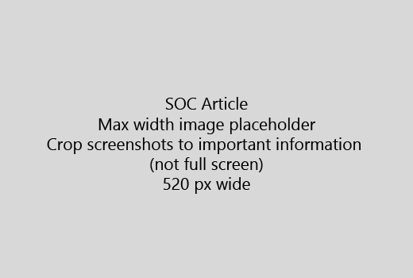

تبدأ المقالة بمقدمة قصيرة جداً (الجملة 1). ضع نفسك في مكان القارئ-لماذا هم هنا؟ ماذا؟Start your article with a very short introduction (1 sentence). Put yourself in the reader's place - why are they here? What should they do? 
  
1. الحصول على التوالي قائمة سريعة من الخطوات اللازمة لإنجاز المهمة.Get straight to a quick list of steps to accomplish the task.
    
    إذا كنت تحتاج لشرح مفهوم، أو لديهم للقيام بالخطوات اللازمة مسبقاً، إضافة ملخص سريع الخطوات حاجتهم، و [الارتباط](https://support.office.com/article/f37e7984-cf03-4fde-92d3-82970d7e241b.aspx) بمفهوم أو الخطوات أدناه.If you need to explain a concept, or they have to do pre-requisite steps, add a quick summary below the step where they need it, and [link](https://support.office.com/article/f37e7984-cf03-4fde-92d3-82970d7e241b.aspx) to the concept or steps. 
    
2. إبقاء إجراءات قصيرة-الخطوات يفضل 5 أو أقل، لا يزيد عن 8.Keep procedures short - preferably 5 or fewer steps, no more than 8.
    
3. استخدام **نمط واجهة المستخدم** لعناصر واجهة المستخدم أو لنص الناس بحاجة إلى إدخال.Use **Ui style** for user interface elements or for text people need to enter. 
    
4. استخدام الأفعال اختيار تحديد، أو أدخل كإجراءات وتنسيق القوائم **قائمة** \> **الأمر**.Use the verbs choose, select, or enter as actions, and format menus as **Menu** \> **Command**.
    
5. بشكل اختياري، إضافة لقطة لسياق (إذا كان يصعب تحديد موقع واجهة المستخدم، أو هو مطلوب لإكمال المهمة).Optionally, add a screenshot for context (if UI is hard to locate, or it's needed to complete the task).
    
    أقصى عرض: 520 بكسل. استخدام نسق قياسي، عدم إظهار أي معلومات شخصية، والاقتصاص لإظهار فقط ما له صلة.Maximum width: 520 pixels. Use a standard theme, do not show any personal information, and crop to show only what's relevant. 
    
    
  
إذا كنت تريد إضافة فيديو أو لقطة للشاشة واستخدام شبكة يتكون من عمودين والخطوات الموجودة في اليسار والفيديو أو الصورة في الجزء الأيسر-راجع [الخطوات ومثال شبكة الفيديو](https://support.office.com/article/14ce8e82-efa0-47f5-bb84-94f078db3dae.aspx).If you want to add a video or screenshot, use a two-column grid and have the steps in the left and the video or screenshot in the right - see [Steps and video grid example](https://support.office.com/article/14ce8e82-efa0-47f5-bb84-94f078db3dae.aspx). 
  
استهدف أكثر من 500 عبارة عن مقالة.Target no more than 500 words for an article.
  
# مثال المادةExample article

[تغيير الصورةChange my photo](https://support.office.com/article/555376e0-1fca-49ba-8434-307a0525c767.aspx)
  

