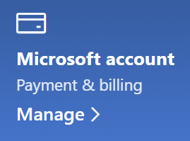

# تغيير معلومات حسابي في MicrosoftChange my Microsoft account information

انتقل إلى [https://account.microsoft.com](https://account.microsoft.com/) ثم سجل الدخول إذا لزم الأمر.Go to [https://account.microsoft.com](https://account.microsoft.com/) and sign in if necessary. سيأخذك هذا إلى لوحة معلومات حسابك.This will take you to your account dashboard.  

**تحرير اسمي والمعلومات الشخصية****Edit my name and personal information**

1. على لوحة معلومات حسابك، إلى بجانب صورة الحساب واسمه، انقر فوق مزيد من الإجراءات > **تحرير ملف التعريف**.On your account dashboard, next to your account picture and name, click **More actions > Edit profile**.
2. في الصفحة **تحرير ملف** التعريف، استخدم الارتباطات المتوفرة لتغيير صورة ملف التعريف والاسم وتاريخ الميلاد والموقع وتفضيلات اللغة المعروضة.On the **Edit profile** page, use the links provided to change your profile picture, name, date of birth, location, and display language preference. لاحظ الارتباطات إلى ملفات تعريف حساب Xbox أو Skype، حيث يمكنك تغيير التفاصيل الخاصة بهذه الحسابات.Note the links to your Xbox or Skype account profiles, where you can change details specific to these accounts.

**إدارة عناوين البريد الإلكتروني وأرقم الهواتف****Manage e-mail addresses and phone numbers**

لدى حساب Microsoft عنوان بريد إلكتروني واحد أو أكثر أو أرقام هواتف مقترنة به ك "أسماء مستعارة".A Microsoft account has one or more e-mail addresses or phone numbers associated with it as “aliases.” لإدارة هذه:To manage these:

1. على لوحة معلومات حسابك، إلى بجانب صورة الحساب واسمه، انقر فوق مزيد من الإجراءات > **تحرير ملف التعريف**.On your account dashboard, next to your account picture and name, click **More actions > Edit profile**.
2. في الصفحة **تحرير ملف التعريف،** انقر **فوق إدارة كيفية تسجيل الدخول إلى Microsoft**.On the **Edit profile** page, click **Manage how you sign in to Microsoft**. 
3. سترى قائمة بأسماء الحساب المستعارة، كما يمكنك إدارة القائمة، بما في ذلك إضافة عناوين البريد الإلكتروني ورقم الهاتف وحذفها.You will see a list of account aliases, and you can manage the list, including adding and deleting e-mail addresses and phone numbers. يمكنك هنا أيضا تحديد الأسماء المستعارة التي يمكن استخدامها في تسجيل الدخول إلى الحساب، والاسم المستعار الذي يعتبر "أساسي"، والذي سيتم عرضه على أجهزة Windows 10.Here you can also select which aliases can be used to sign in to the account, and which alias is considered “primary,” which will be displayed on your Windows 10 devices.

**إدارة طرق الدفع، بالإضافة إلى الاسم وعنوان الفوترة****Manage payment methods, as well as name and address for billing** 

1. على لوحة معلومات حسابك، إلى بجانب صورة الحساب واسمه، انقر فوق مزيد من الإجراءات > **تحرير ملف التعريف**.On your account dashboard, next to your account picture and name, click **More actions > Edit profile**.
2. ضمن **دفع & الفوترة،** انقر **فوق إدارة**.Under **Payment & billing** click **Manage**.

    

3. يمكنك هنا إضافة طرق الدفع وعناوين الفوترة المقترنة بها وتحريرها وإزالتها.Here you can add, edit, and remove payment methods and their associated billing addresses. 
