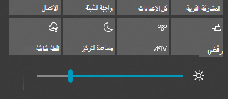

# تغيير سطوع الشاشة في Windows 10

إذا كان Windows 10 أحدث من الإصدار 1903، فيتبوع شريط تمرير السطوع في مركز الإجراءات.  لفتح مركز الإجراءات، انقر  فوق الزر إعلام في الجانب الأيسر من شريط المهام، أو اضغط على **Windows home + A** على لوحة المفاتيح.

إذا كان Windows 10 لديك إصدارا سابقا، يمكنك العثور على شريط تمرير السطوع عن طريق الذهاب إلى إعدادات > نظام > **[عرض](ms-settings:display?activationSource=GetHelp)**.

**الملاحظات**:

- قد لا ترى تغيير السطوع لشرائح العرض المضمنة على أجهزة كمبيوتر سطح المكتب التي لديها جهاز عرض خارجي. لتغيير سطوع جهاز عرض خارجي، استخدم عناصر التحكم على جهاز العرض.
- إذا لم يكن لديك كمبيوتر سطح مكتب ولم يظهر شريط التمرير أو لا يعمل، فحاول تحديث برنامج تشغيل العرض. في مربع البحث على شريط المهام، اكتب **إدارة الأجهزة**، ثم حدد **إدارة الأجهزة** من قائمة النتائج. في **إدارة الأجهزة**، حدد **محولات العرض**، ثم حدد محول العرض. اضغط مع الاستمرار (أو انقر بزر الماوس الأيمن) على اسم محول العرض وانقر فوق **تحديث برنامج التشغيل**؛ ثم اتبع الإرشادات.
