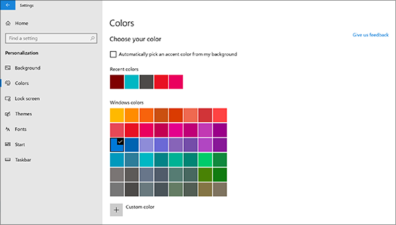
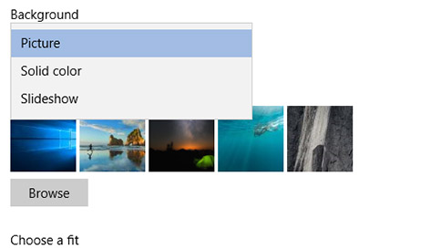

# تغيير خلفية سطح المكتب والألوان

لتغيير إعداد الألوان، انتقل إلى**ألوان****تخصيص** > **إعدادات** >  **البدء،** > ثم اختر اللون الخاص بك أو دع Windows يسحب لون ًا باللهجة من خلفيتك.

لتغيير خلفية سطح المكتب، انتقل إلى**خلفية****تخصيص** > **إعدادات** >  **البدء،** > ثم اختر صورة أو لونًا صلبًا أو قم بإنشاء عرض شرائح للصور. 

هل تريد المزيد من خلفيات سطح المكتب والألوان؟ قم بزيارة [متجر Microsoft](https://www.microsoft.com/store/collections/windowsthemes) للاختيار من بين عشرات الموضوعات المجانية.
