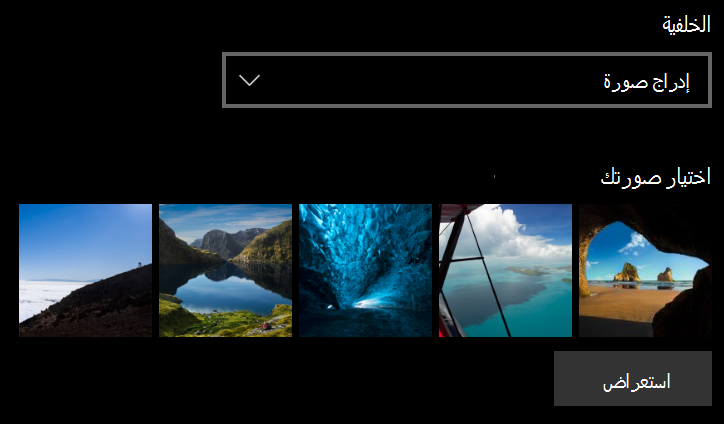
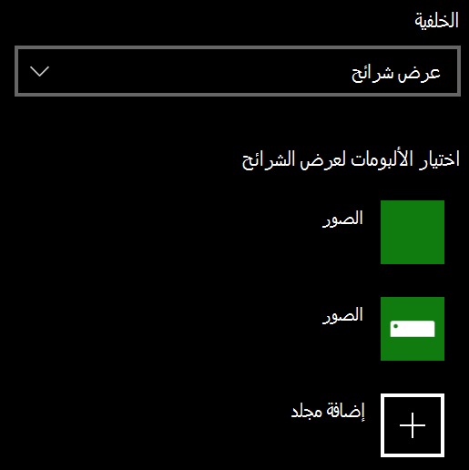

# تغيير خلفية شاشة القفل

- انتقل إلى **شاشة قفل****تخصيص** > **الإعدادات** > . أو انقر أو اضغط [هنا](ms-settings:lockscreen?activationSource=GetHelp).

- لتعيين صورة خلفية مخصصة، حدد **صورة** من القائمة المنسدلة **للخلفية،** واختر الصورة أو **استعرضها.**

  

- لإعداد عرض شرائح للصور المخصصة، حدد **عرض الشرائح** من القائمة **المنسدلة** الخلفية، واختر ألبومًا أو أضف مجلدًا يحتوي على الصور لعرض الشرائح.

  
