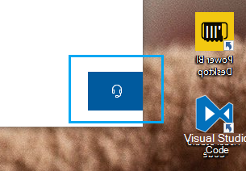

# اتصل بنا عن طريق النقر على زر سماعة الرأس

إذا كنت ترغب في الاتصال بدعم Microsoft، يرجى **النقر على الاتصال بنا** في الزاوية اليسرى السفلى من هذا التطبيق. داخل نافذة الطيران، سيتم إرشادك إلى قناة الدعم الصحيحة بعد اختيار منتجك وفئة الإصدار.

يمكنك الاستمرار في التفاعل مع بقية التطبيق حتى بعد بدء جلسة الاتصال بنا. يمكن تصغير لوحة الاتصال بنا مؤقتًا من خلال النقر في أي مكان آخر داخل التطبيق. للعودة إلى نفس الجلسة، فقط انقر **فوق الاتصال بنا** مرة أخرى.
