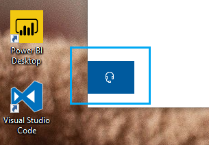

# اتصل بنا بالنقر فوق زر سماعه الراسContact us by clicking the headphone button

إذا كنت ترغب في الاتصال بدعم Microsoft ، يرجى النقر فوق **الاتصال بنا** في الزاوية السفلية اليمني من هذا التطبيق.If you'd like to contact Microsoft Support, please click **Contact us** in the lower left corner of this app. داخل النافذة الحركة ، سيتم إرشادك إلى قناه الدعم المناسبة بعد اختيار فئة المنتج والمشكلة.Inside the fly-out window, you will be guided to the right support channel after choosing your product and issue category.

يمكنك الاستمرار في التفاعل مع باقي التطبيق حتى بعد بدء جلسة اتصال في الولايات المتحدة.You can keep interacting with the rest of the app even after you have initiated a Contact us session. يمكن تصغير لوحه "الاتصال بنا" بشكل مؤقت بالنقر في اي مكان آخر داخل التطبيق.The Contact us panel can be temporarily minimized by clicking anywhere else inside the app. للعودة إلى جلسة العمل نفسها ، ما عليك سوي **الاتصال بنا** مره أخرى.To return to the same session, just click **Contact us** again.
