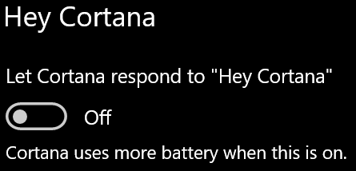

# Cortana لا تتحدث إلي أو لا تسمعنيCortana doesn’t talk to me or can’t hear me

إذا كنت تحاول استخدام ميزة "Hey Cortana"، التي تسمح لك بالتحدث إلى Cortana دون تحديد زر Cortana على شريط المهام أو زر الميكروفون في لوحة Cortana، فتأكد من تمكين الميزة:If you are trying to use the "Hey Cortana" feature, which allows you to talk to Cortana without selecting the Cortana button on the taskbar or the microphone button in the Cortana panel, confirm that the feature is enabled:

1. انتقل إلى **البدء**، ثم حدد إعدادات > **[Cortana](ms-settings:cortana?activationSource=GetHelp)**.Go to **Start**, then select **[Settings > Cortana](ms-settings:cortana?activationSource=GetHelp)**.
2. ضمن **Hey Cortana**، قم بتبديل زر التبديل **السماح ل Cortana بالرد على "Hey Cortana"** إلى **تشغيل**.Under **Hey Cortana**, switch the **Let Cortana respond to "Hey Cortana"** toggle to **On**.

**هل تمنع إعدادات الخصوصية Cortana من سماعك؟****Are your privacy settings preventing Cortana from hearing you?**

يمكن أن تمنع إعدادات الخصوصية Cortana من الاستجابة لصوتك.Your privacy settings can prevent Cortana from responding to your voice.
- تحقق للتأكد من تشغيل التعرف على الكلام عبر الإنترنت:Check to make sure Online Speech recognition is turned on:
    - انتقل إلى **بدء**، ثم انقر فوق إعدادات > **[الخصوصية > الكلام](ms-settings:privacy-speech?activationSource=GetHelp)**.Go to **Start**, then click **[Settings > Privacy > Speech](ms-settings:privacy-speech?activationSource=GetHelp)**.
    - ضمن **التعرف على الكلام عبر الإنترنت**، قم بتبديل الإعداد إلى **تشغيل**.Under **Online speech recognition**, switch the setting to **On**.
- تحقق للتأكد من أن Cortana لديها الإذن للوصول إلى الميكروفون.Check to make sure Cortana has permission to access your microphone. 
    - انتقل إلى البدء، ثم انقر فوق إعدادات > **[الخصوصية > الميكروفون.](ms-settings:privacy-microphone?activationSource=GetHelp)**Go to Start, then click **[Settings > Privacy > Microphone](ms-settings:privacy-microphone?activationSource=GetHelp)**.
    - ضمن **اختيار التطبيقات التي** يمكنها الوصول إلى الميكروفون ، ابحث عن **Cortana** ضمن قائمة التطبيقات والخدمات وتأكد من تبديل المفتاح إلى **تشغيل**.Under **Choose which apps can access your microphone**, look for **Cortana** within the list of apps and services and make sure the switch is toggled to **On**.

علاوة على ذلك، الرجاء أيضا التأكد من أن السماعات أو الميكروفونات لديك تعمل من أجل التحدث إلى Cortana.Moreover, please also make sure that your speakers or microphones are up and working in order to talk to Cortana.
