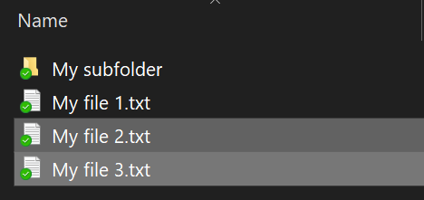

# تشفير الملفات أو المجلد في Windows 10

يمكنك تشفير قرص كامل باستخدام BitLocker ، ولكن لتشفير الملفات أو المجلدات الفردية فقط (ومحتوياتها):

1. في **مستكشف الملفات**، حدد الملف (ق) / المجلد (ق) التي تريد تشفيرها. في هذا المثال، تم تحديد ملفين:

    

2. انقر باليمين على الملفات المحددة وانقر فوق **الخصائص**.

3. في إطار **الخصائص،** انقر فوق **متقدم**.

4. في إطار **الخصائص المتقدمة،** حدد محتويات التشفير لتأمين خانة اختيار **البيانات:**

    

5. انقر فوق **موافق**.
