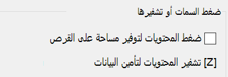

# تشفير الملفات أو المجلدات في نظام التشغيل Windows 10

يمكنك تشفير قرص بأكمله باستخدام BitLocker، ولكن لتشفير الملفات أو المجلدات الفردية فقط (ومحتوياتها):

1. في **File Explorer**، حدد الملف (الملفات)/المجلد (المجلدات) الذي تريد تشفيره. في هذا المثال، تم تحديد ملفين:

    

2. انقر بزر الماوس الأيمن فوق الملفات المحددة وانقر فوق **خصائص**.

3. في نافذة **الخصائص**، انقر فوق **متقدم**.

4. في نافذة **الخصائص المتقدمة**، حدد خانة الاختيار **تشفير المحتويات لتأمين البيانات**:

    

5. انقر فوق **موافق**.
