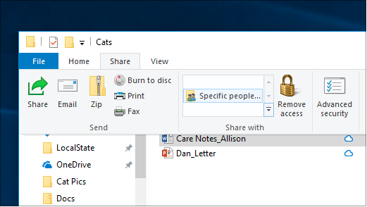

# مشاركة الملفات عبر شبكة في Windows 10File sharing over a network in Windows 10

**ملاحظة:** إذا كنت تستخدم HomeGroup مسبقًا لمشاركة الملفات، يُرجى ملاحظة أنه تمت إزالة HomeGroup من Windows 10 (الإصدار 1803).**Note**: If you previously used HomeGroup for file sharing, please note that HomeGroup has been removed from Windows 10 (Version 1803). يمكنك الآن مشاركة الطابعات والملفات باستخدام الميزات المضمنة في Windows 10.You can now share printers and files by using built-in features in Windows 10.

**لمشاركة الملفات أو المجلدات عبر شبكة اتصال****To share files or folders over a network**

- في **مستكشف الملفات**، حدد ملفًا > انقر فوق علامة التبويب **المشاركة** في أعلى > في قسم **المشاركة مع** ، انقر فوق أشخاص **محددين**.In **File Explorer**, select a file > click the **Share** tab at the top > in the **Share with** section, click **Specific people**.

    
          
- إذا قمت بتحديد ملفات متعددة في وقت واحد، يمكنك مشاركتها كلها بنفس الطريقة.If you select multiple files at once, you can share them all in the same way. وهو يعمل للمجلدات ، أيضا.It works for folders, too.

**لمشاهدة الأجهزة الموجودة على الشبكة التي تشارك الملفات****To see devices on the network that are sharing files**

- في **مستكشف الملفات**، انتقل إلى **الشبكة**.In **File Explorer**, go to **Network**. إذا لم يتم تمكين اكتشاف الشبكة، سترى رسالة خطأ "تم إيقاف تشغيل اكتشاف الشبكة..."If Network discovery is not enabled, you will see an error message "Network discovery is turned off..."

- انقر فوق **يتم إيقاف تشغيل اكتشاف الشبكة،** ثم انقر فوق تشغيل اكتشاف الشبكة ومشاركة **الملفات**.Click the **Network discovery is turned off** banner, then click **Turn on network discovery and file sharing**.

    

[اقرأ المزيد عن مشاركة الملفات عبر شبكة اتصالRead more about file sharing over a network](https://support.microsoft.com/help/4092694/windows-10-file-sharing-over-a-network)

[مشاركة الملفات باستخدام التطبيقات وOneDrive ورسائل البريد الإلكتروني والمزيدShare files using apps, OneDrive, emails, and more](https://support.microsoft.com/help/4027674/windows-10-share-files-in-file-explorer)
