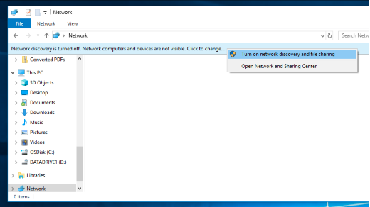

# مشاركة الملفات عبر شبكة في Windows 10

**ملاحظة:** إذا سبق لك استخدام HomeGroup لمشاركة الملفات، فيرجى ملاحظة أنه تمت إزالة HomeGroup من Windows 10 (الإصدار 1803). يمكنك الآن مشاركة الطابعات والملفات باستخدام الميزات المضمنة في Windows 10.

**لمشاركة الملفات أو المجلدات عبر شبكة**

- في **مستكشف الملفات**، حدد ملفا  > فوق علامة التبويب مشاركة  في الجزء العلوي > في المقطع مشاركة مع، انقر فوق **أشخاص محددون**.

    
          
- إذا قمت بتحديد ملفات متعددة في وقت واحد، يمكنك مشاركتها كلها بالطريقة نفسها. وهو يعمل مع المجلدات أيضا.

**لرؤية الأجهزة على الشبكة التي تشارك الملفات**

- في **مستكشف الملفات**، انتقل إلى **الشبكة**. إذا لم يتم تمكين اكتشاف الشبكة، سترى رسالة خطأ "تم إيقاف تشغيل اكتشاف الشبكة..."

- انقر فوق **شعار إيقاف تشغيل** اكتشاف الشبكة، ثم انقر فوق تشغيل اكتشاف الشبكة ومشاركة **الملفات**.

    

[قراءة المزيد حول مشاركة الملفات عبر شبكة](https://support.microsoft.com/help/4092694/windows-10-file-sharing-over-a-network)

[مشاركة الملفات باستخدام التطبيقات و OneDrive ورسائل البريد الإلكتروني والمزيد](https://support.microsoft.com/help/4027674/windows-10-share-files-in-file-explorer)
