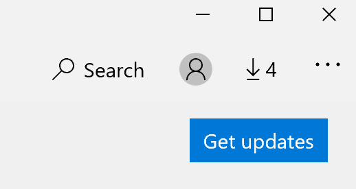

# إصلاح لغة عرض التطبيقات

بعد تغيير لغة العرض في Windows 10، قد لا تزال بعض التطبيقات تستخدم اللغة السابقة عند فتحها. يحدث هذا لأنه يجب تنزيل إصدارات جديدة من التطبيقات لهذه اللغة من المتجر. لإصلاح هذه المشكلة، يمكنك إما انتظار التحديث التلقائي، أو يمكنك تثبيت الإصدار المحدث من التطبيقات يدويًا.

لتثبيت التحديث يدويًا، افتح **متجر Microsoft** وانقر على **التنزيلات والتحديثات** في الزاوية اليمنى العليا. ثم انقر **فوق الحصول على التحديثات**. إذا لم يتم تغيير اللغة بعد اكتمال التحديث، حاول إعادة تشغيل الكمبيوتر.

لقراءة المزيد حول إعدادات الإدخال وعرض اللغة، راجع [إدارة إعدادات الإدخال وعرض اللغة في Windows 10](https://support.microsoft.com/help/4027670/windows-10-add-and-switch-input-and-display-language-preferences).
