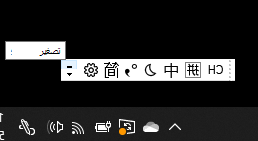
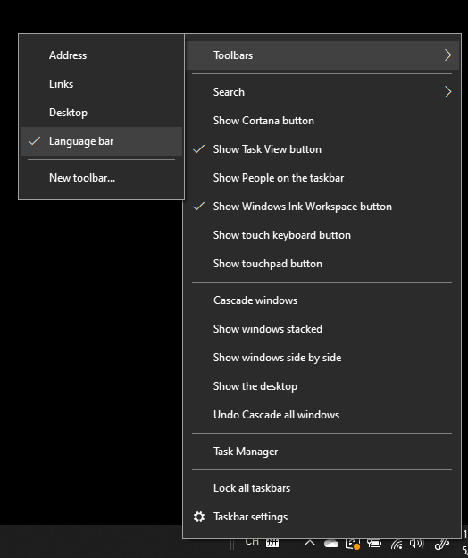
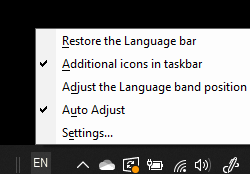

# إخفاء شريط اللغة أو عرضه أو إعادة تعيينه

**لتقليل شريط اللغة:**

يمكنك النقر فوق زر التصغير في الزاوية اليمنى العليا من شريط اللغة. أو يمكنك فقط سحب شريط اللغة إلى شريط المهام، والذي سيقلله تلقائيًا.

**لتخرج شريط اللغة:**

إذا كنت لا تريد إرساء شريط اللغة في شريط المهام، فانقر بزر الماوس الأيمن على أي مساحة فارغة في شريط المهام، وألغ تحديد خيار **شريط اللغة** في قائمة أشرطة الأدوات. سيؤدي ذلك إلى ظهور شريط اللغة خارج شريط المهام، تمامًا مثل لقطة الشاشة السابقة.

**لاستعادة شريط اللغة إلى الافتراضي:**

انقر بزر اللغة في شريط الأدوات، وانقر فوق استعادة خيار **شريط اللغة** في القائمة. سيؤدي ذلك إلى استعادته إلى الافتراضي.

