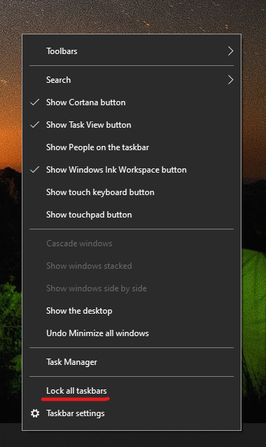

# نقل شريط المهام إلى جانب سطح المكتب أو أعلىه

أولا، يرجى تأكيد إلغاء تأمين شريط المهام. لمعرفة ما إذا كان شريط المهام غير مؤمن أم لا، انقر  ب زر الماوس الأيمن فوق أي مساحة فارغة على شريط المهام وتأكد مما إذا كان قفل شريط المهام به علامة اختيار بجانبه. إذا كانت هناك علامة اختيار، يتم تأمين شريط المهام ولا يمكن نقله. يؤدي النقر **فوق تأمين شريط المهام** مرة واحدة إلى إلغاء تأمينه وإزالة علامة الاختيار.

إذا كان لديك أجهزة عرض متعددة تعرض شريط المهام، سترى **تأمين كل عارضات المهام**.

بمجرد إلغاء تأمين شريط المهام، يمكنك الضغط مع الاستمرار على أي مساحة فارغة على شريط المهام وسحبها إلى الموقع الذي تريده على الشاشة. يمكنك أيضا القيام بذلك بالنقر ب الماوس الأيمن فوق أي مساحة فارغة على شريط المهام، ثم الانتقال إلى إعدادات شريط المهام > شريط المهام ** على الشاشة.**
