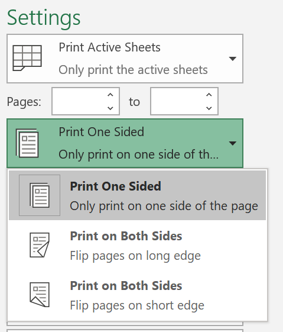
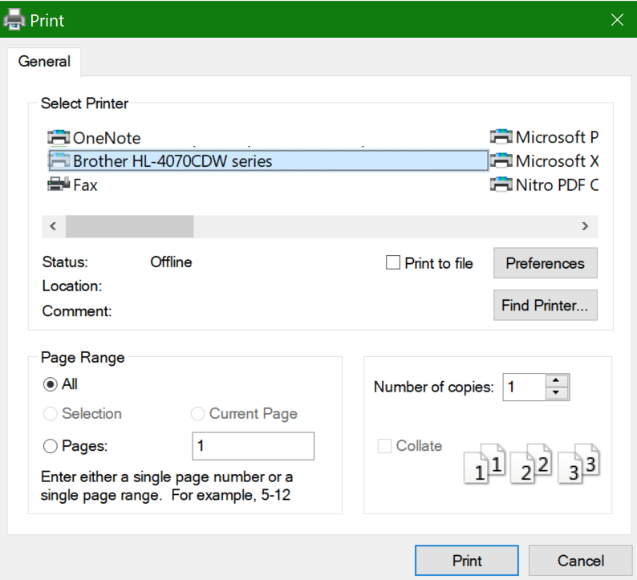

# الطباعة علي كلا وجهي الورقة (الطباعة المزدوجة)

**هل الطابعة قادره علي الطباعة المزدوجة ؟**

ينبغي ان يعلمك ملخص ميزات الطابعة أو كتيب ما إذا كانت قادره علي الطباعة علي كلا وجهي الورقة ، والمعروف أيضا باسم "الطباعة المزدوجة". إذا كان لديك Microsoft Office ، فمن الطرق الأخرى لمعرفه ذلك بفتح تطبيق Office مثل Word أو Excel ، والانتقال إلى **ملف > الطباعة**، والتاكد من تحديد الطابعة المناسبة ، والبحث عن الامكانيه في المقطع إعدادات. على سبيل المثال: 

**الطباعة المزدوجة في Microsoft Office**

إذا كانت الطابعة قادره علي الطباعة علي كلا الجانبين ، فعند الانتقال إلى **الملف > الطباعة** في تطبيق Office ، ستري خيار "الطباعة علي الوجهين" ، كما هو موضح في المثال أعلاه.  حدد نوع الطباعة المزدوجة التي تريدها (انعكاس عند الحافة الطويلة ، أو انعكاس عند الحافة القصيرة) ، وانقر فوق **طباعه** لبدء النسخة المطبوعة.

**الطباعة المزدوجة من اي تطبيق**

في العديد من التطبيقات عند الطباعة ، ستري مربع حوار طباعه عاما يبدو علي الشكل التالي: 

تاكد من تحديد الطابعة المناسبة ، ثم انقر فوق **تفضيلات** لفتح نافذه تفضيلات الطابعة. إذا كانت الطابعة قادره علي الطباعة المزدوجة ، ستظهر امكانيه تمكين هذا الخيار لمهمة الطباعة الحالية في هذه النافذة.
