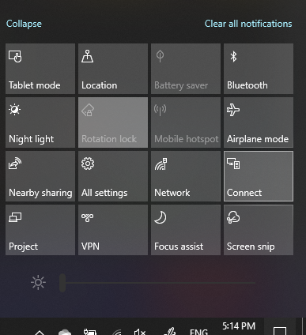

# المشروع إلى جهاز كمبيوترProject to a PC

على جهازك الوجهة (العرض إلى)، ابحث عن "إعدادات الإسقاط" لفتح صفحة الإعدادات من **العرض على هذا الكمبيوتر**.On your destination device (projecting to), search for "Projection Settings" to open the Settings page of **Projecting to this PC**. ثم تأكد من أن:Then make sure that:
- "يمكن لبعض أجهزة ويندوز والروبوت المشروع إلى هذا الكمبيوتر عندما تقول انها موافق" يتم تعيين القائمة المنسدلة إلى **دائما إيقاف**."Some Windows and Android devices can project to this PC when you say it's OK" drop-down menu is set to **Always Off**.
- يتم تعيين القائمة المنسدلة "اطلب العرض إلى هذا الكمبيوتر" إلى **كل مرة يتطلب اتصال .**"Ask to project to this PC" drop-down menu is set to **Every time a connection is required**.
- تم تعيين القائمة المنسدلة "تتطلب رقم التعريف الشخصي للإقران" إلى **أبداً**."Require PIN for pairing" drop-down menu is set to **Never**.

على جهازك الوجهة، قم بتشغيل **تطبيق Connect** من خلال **البدء** والبحث عن "الاتصال".On your destination device, launch **Connect** app by going to **Start** and search for "Connect".

ثم، على الجهاز المصدر الذي تحاول المشروع من:Then, on your source device that you are trying to project from:

1. اضغط على **مفتاح Windows + A** لفتح مركز الإجراءات.Press **Windows key + A** to open Action Center.
2. انقر فوق **الاتصال**.Click **Connect**.
3. انقر فوق الجهاز الذي تريد عرض الشاشة عليه.Click the device you want to project the screen to.

بعد الخطوات المذكورة أعلاه، يجب أن يعرض جهازك الوجهة شاشة الجهاز المصدر كما لو كان جهاز عرض ثانوي.After the above steps, your destination device should display the screen of the source device as if it is a secondary monitor.
