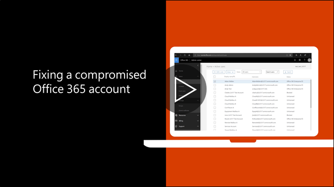

# الخطوات الموصى بها حتى إذا تم اختراق حساب

  
1. [إعادة تعيين المرور كلمة](https://support.office.com/article/7a5d073b-7fae-4aa5-8f96-9ecd041aba9c) فورا. لا تتصل كلمة المرور عبر البريد الإلكتروني للمستخدم النهائي. 
    
2. قم بإزالة أي مشبوه [توجيه العناوين](https://support.office.com/article/ab5eb117-0f22-4fa7-a662-3a6bdb0add74) على مستوى علبة البريد. 
    
3. إزالة أي مشبوه [قواعد علبة الوارد](https://support.office.com/article/1433E3A0-7FB0-4999-B536-50E05CB67FED) في علبة البريد. 
    
4. إذا تم حظر المستخدم من إرسال بريد إلكتروني، [انتقل إلى "المستخدمين المقيدين" لإلغاء حظر الحساب](https://protection.office.com/?hash=/restrictedusers). بمجرد الانتهاء، يجب أن يكون المستخدم قادراً على استئناف إرسال الرسائل خلال ساعة واحدة.
    
5. إزالة حساب المستخدم من أية [مجموعات الأدوار الإدارية](https://support.office.com/article/eac4d046-1afd-4f1a-85fc-8219c79e1504) حتى تكون واثقاً من أنه لن يتم تسوية الحساب. 
    
لتقليل احتمال إخلال ببيانات أو حساب المكسور في المستقبل، نوصي بقراءة [المقالة ممارسات أفضل مكتب الأمن 365](https://support.office.com/article/9295e396-e53d-49b9-ae9b-0b5828cdedc3).
  

