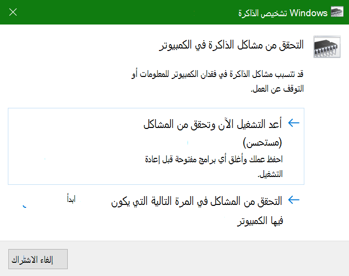
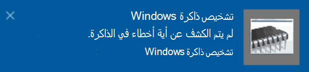

# تشغيل تشخيص الذاكرة في Windows في Windows 10

إذا تعطلت تطبيقات Windows وتطبيقات على الكمبيوتر الشخصي أو تجمدت أو تصرفت بطريقة غير مستقرة، فقد تواجه مشكلة في ذاكرة الكمبيوتر (RAM). يمكنك تشغيل تشخيص الذاكرة ل Windows للتحقق من مشاكل ذاكرة الوصول العشوائي للكمبيوتر الشخصي.

في مربع البحث على شريط المهام، اكتب **تشخيص الذاكرة**، ثم حدد Windows **Memory Diagnostic**. 

لتشغيل التشخيص، يجب إعادة تشغيل الكمبيوتر. لديك خيار إعادة التشغيل على الفور (الرجاء حفظ عملك وأغلق المستندات المفتوحة والبريد الإلكتروني أولا)، أو قم لجدولة التشخيص ليعمل تلقائيا في المرة التالية التي يقوم فيها الكمبيوتر بإعادة تشغيل:

عند إعادة تشغيل الكمبيوتر الشخصي، سيتم تشغيل أداة تشخيص الذاكرة ل **Windows** تلقائيا. سيتم عرض الحالة والتقدم عند تشغيل التشخيص، وسيبقى لديك خيار إلغاء التشخيصات عن طريق الضغط على المفتاح **ESC** على لوحة المفاتيح.

عند اكتمال التشخيص، سيبدأ Windows بشكل طبيعي.
بعد إعادة التشغيل مباشرة، عندما يظهر سطح المكتب، سيظهر إعلام (بجانب أيقونة **مركز** الإجراءات على شريط المهام)، للإشارة إلى ما إذا تم العثور على أي أخطاء في الذاكرة. على سبيل المثال:

فيما يلي أيقونة مركز الإجراءات:  

ونموذج إعلام: 

إذا فاتك الإعلام، يمكنك تحديد  أيقونة مركز الإجراءات على  شريط المهام لعرض مركز الإجراءات لمشاهدة قائمة قابلة للتمرير من الإعلامات.

لمراجعة المعلومات المفصلة، **اكتب** حدثا في مربع البحث على شريط المهام، ثم حدد **عارض الأحداث**. في **الجزء** الأيسر من عارض الأحداث، انتقل إلى **سجلات Windows > System**. في الجزء الأيسر، قم بفحص القائمة لأسفل أثناء  النظر إلى العمود المصدر، حتى ترى الأحداث باستخدام **القيمة المصدر MemoryDiagnostics-Results**. يمكنك تمييز كل حدث من هذا النوع لمشاهدة معلومات النتائج في المربع ضمن علامة **التبويب عام** أسفل القائمة.
