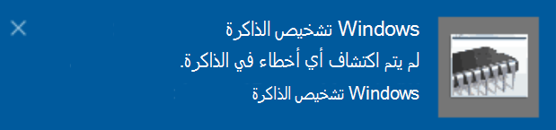

# تشغيل تشخيص الذاكرة ل Windows في Windows 10

إذا تعطل Windows والتطبيقات علي جهاز الكمبيوتر لديك أو تقوم بتجميده أو يعمل بطريقه غير مستقره ، فقد تواجه مشكله في ذاكره الكمبيوتر الشخصي (RAM). يمكنك تشغيل تشخيص الذاكرة ل Windows للتحقق من وجود مشاكل في ذاكره الوصول العشوائي الخاصة بالكمبيوتر الشخصي.

في مربع البحث علي شريط المهام ، اكتب **تشخيص الذاكرة**، ثم حدد **تشخيص الذاكرة في Windows**. 

لتشغيل التشخيص ، يجب أعاده تشغيل الكمبيوتر. يتوفر لديك الخيار لأعاده التشغيل علي الفور (الرجاء حفظ عملك وإغلاق المستندات ورسائل البريد الكتروني المفتوحة أولا) ، أو جدوله التشخيص بحيث يتم تشغيله تلقائيا في المرة التالية التي تتم فيها أعاده تشغيل الكمبيوتر:

عند أعاده تشغيل الكمبيوتر ، سيتم تشغيل **أداه تشخيص الذاكرة في Windows** تلقائيا. سيتم عرض الحالة والتقدم كعمليه التشخيص ، سيتوفر لديك خيار إلغاء التشخيص عن طريق القيام بالعمل علي المفتاح **ESC** علي لوحه المفاتيح.

عند اكتمال التشخيص ، سيبدا تشغيل Windows بشكل طبيعي.
بعد أعاده التشغيل مباشره ، عند ظهور سطح المكتب ، سيظهر اعلام (إلى جانب أيقونه **مركز الصيانة** علي شريط المهام) ، للاشاره إلى ما إذا تم العثور علي أخطاء في الذاكرة. على سبيل المثال:

اليك أيقونه مركز الصيانة:  

والاعلام النموذجي: 

إذا فقدت الاعلام ، يمكنك تحديد أيقونه **مركز الصيانة** علي شريط المهام لعرض **مركز الصيانة** ورؤية قائمه الإشعارات القابلة للتمرير.

لمراجعه المعلومات التفصيلية ، اكتب **حدث** في مربع البحث علي شريط المهام ، ثم حدد **عارض الاحداث**. في الجزء الأيمن من **عارض الاحداث**، انتقل إلى **سجلات Windows > نظام**. في الجزء الأيسر ، قم بالمسح الضوئي لأسفل في القائمة اثناء البحث في العمود **المصدر** ، حتى تري الاحداث التي تتضمن **القيمة المصدر ميموريدياجنوستيكس النتائج**. يمكنك تمييز كل حدث والاطلاع علي معلومات النتائج في المربع ضمن علامة التبويب **عام** الموجودة أسفل القائمة.
