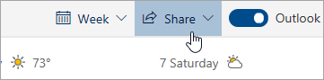

# المشاركة مع Outlook على الويبSharing with Outlook on the web

من التقويم، على شريط الأدوات في أعلى الصفحة، حدد **مشاركة**، واختر التقويم الذي تريد مشاركته.From your Calendar, on the toolbar at the top of the page, select **Share**, and choose the calendar you want to share.

    

**ملاحظة**: لا يمكنك مشاركة التقويمات التي يملكها أشخاص آخرون.**Note**: You can't share calendars owned by other people.

- أدخل اسم الشخص الذي تريد مشاركة التقويم معه أو عنوان بريده الإلكتروني.Enter the name or email address of the person you want to share your calendar with.
- اختر الطريقة التي تريد أن يستخدم بها الشخص التقويم:Choose how you want the person to use your calendar:
    - **يمكن عرض عندما أكون مشغولا**   يتيح لهم معرفة وقت انشغالك ولكن لا يتضمن تفاصيل مثل موقع الحدث.**Can view when I'm busy** lets them see when you're busy but doesn't include details like the event location.
    - **يمكن عرض العناوين والمواقع**   يتيح لهم معرفة وقت انشغالك، بالإضافة إلى عنوان الأحداث وموقعها.**Can view titles and locations** lets them see when you're busy, as well as the title and location of events.
    - **يمكن عرض جميع التفاصيل**   يتيح لهم رؤية جميع تفاصيل الأحداث الخاصة بك.**Can view all details** lets them see all the details of your events.
    - **يمكن تحرير**   يتيح لهم تحرير التقويم الخاص بك.**Can edit** lets them edit your calendar.
    - **مندوب**   يتيح لهم تحرير التقويم ومشاركته مع الآخرين.**Delegate** lets them edit your calendar and share it with others.
- حدد **مشاركة**.Select **Share**.
