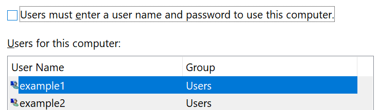

# تسجيل الدخول إلى Windows 10 دون استخدام كلمه مرور

لتجنب الحاجة إلى كتابه كلمه مرور في "بدء تشغيل Windows" ، نوصيك باستخدام أحد خيارات تسجيل الدخول الامنه في Windows Hello ، مثل رمز PIN أو التعرف علي الوجه أو بصمه الاصبع ، إذا كانت متوفرة. إذا كنت ترغب حقا في تعطيل تسجيل الدخول الأمن ، فراجع الإرشادات "تسجيل الدخول تلقائيا إلى Windows 10" أدناه.

**حماية البدائل في Windows Hello إلى كلمه مرور الحساب**

انتقل إلى **إعدادات > حسابات > خيارات تسجيل الدخول** (أو انقر [هنا](ms-settings:signinoptions?activationSource=GetHelp)). سيتم ادراج خيارات تسجيل الدخول المتوفرة. على سبيل المثال:

انقر فوق أحد الخيارات أو اضغط عليه لتكوينه. في المرة التالية التي تقوم فيها بتشغيل Windows أو إلغاء تامينه ، ستتمكن من استخدام الخيار جديد بدلا من كلمه المرور. 

**تسجيل الدخول تلقائيا إلى Windows 10**

**ملاحظه**: ان تسجيل الدخول التلقائي مناسب ، ولكنه يقدم خطورة علي الأمان ، خاصه إذا كان الأشخاص الذين يمكنهم الوصول إلى الكمبيوتر الشخصي. 

1. انقر فوق زر **البدء** أو اضغط عليه في شريط المهام.

2. اكتب **نيتبلويز** واضغط علي المفتاح Enter لفتح نافذه حسابات المستخدمين.

3. في **حسابات المستخدمين**، انقر فوق الحساب الذي تريد تسجيل الدخول اليه تلقائيا عند بدء تشغيل Windows.

4. قم بإلغاء تحديد خانه الاختيار "يجب علي المستخدمين إدخال اسم المستخدم وكلمه المرور لاستخدام هذا الكمبيوتر".

    

5. انقر فوق **موافق**. ستتم مطالبتك بإدخال كلمه المرور الخاصة بالحساب الذي حددته وتاكيدها. انقر فوق **موافق** للانتهاء. في المرة التالية التي يتم فيها بدء تشغيل Windows 10 ، سيقوم تلقائيا بتسجيل الدخول إلى الحساب الذي حددته.
