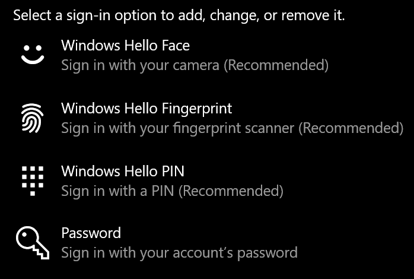

# تسجيل الدخول إلى Windows 10 دون استخدام كلمه مرورSign-in to Windows 10 without using a password

لتجنب الحاجة إلى كتابه كلمه مرور في "بدء تشغيل Windows" ، نوصيك باستخدام أحد خيارات تسجيل الدخول الامنه في Windows Hello ، مثل رمز PIN أو التعرف علي الوجه أو بصمه الاصبع ، إذا كانت متوفرة.To avoid having to type a password at Windows startup, we recommend you use one of the Windows Hello secure sign-in options, like a PIN, face recognition, or fingerprint, if available. إذا كنت ترغب حقا في تعطيل تسجيل الدخول الأمن ، فراجع الإرشادات "تسجيل الدخول تلقائيا إلى Windows 10" أدناه.If you really want to disable secure sign-in, see the "Automatically sign in to Windows 10" instructions below.

**حماية البدائل في Windows Hello إلى كلمه مرور الحساب****Secure Windows Hello alternatives to the account password**

انتقل إلى **إعدادات > حسابات > خيارات تسجيل الدخول** (أو انقر [هنا](ms-settings:signinoptions?activationSource=GetHelp)).Go to **Settings  > Accounts > Sign-in options** (or click [here](ms-settings:signinoptions?activationSource=GetHelp)). سيتم ادراج خيارات تسجيل الدخول المتوفرة.Available sign-in options will be listed. على سبيل المثال:For example:

انقر فوق أحد الخيارات أو اضغط عليه لتكوينه.Click or tap one of the options to configure it. في المرة التالية التي تقوم فيها بتشغيل Windows أو إلغاء تامينه ، ستتمكن من استخدام الخيار جديد بدلا من كلمه المرور.Next time you start or unlock Windows, you will be able to use the new option instead of a password. 

**تسجيل الدخول تلقائيا إلى Windows 10****Automatically sign-in to Windows 10**

**ملاحظه**: ان تسجيل الدخول التلقائي مناسب ، ولكنه يقدم خطورة علي الأمان ، خاصه إذا كان الأشخاص الذين يمكنهم الوصول إلى الكمبيوتر الشخصي.**Note**: Automatic sign-in is convenient, but introduces a security risk, especially if your PC is accessible by multiple people. 

1. انقر فوق زر **البدء** أو اضغط عليه في شريط المهام.Click or tap the **Start** button in the Taskbar.

2. اكتب **نيتبلويز** واضغط علي المفتاح Enter لفتح نافذه حسابات المستخدمين.Type **netplwiz** and hit the Enter key to open the User Accounts window.

3. في **حسابات المستخدمين**، انقر فوق الحساب الذي تريد تسجيل الدخول اليه تلقائيا عند بدء تشغيل Windows.In **User Accounts**, click the account you want to automatically sign in to when Windows starts.

4. قم بإلغاء تحديد خانه الاختيار "يجب علي المستخدمين إدخال اسم المستخدم وكلمه المرور لاستخدام هذا الكمبيوتر".Uncheck the "Users must enter a user name and password to use this computer" checkbox.

    

5. انقر فوق **موافق**.Click **OK**. ستتم مطالبتك بإدخال كلمه المرور الخاصة بالحساب الذي حددته وتاكيدها.You will be asked to enter and confirm the password for the account you selected. انقر فوق **موافق** للانتهاء.Click **OK** to finish. في المرة التالية التي يتم فيها بدء تشغيل Windows 10 ، سيقوم تلقائيا بتسجيل الدخول إلى الحساب الذي حددته.Next time Windows 10 starts, it will automatically sign in to the account you selected.
