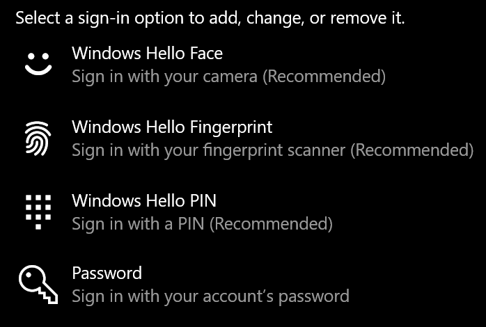
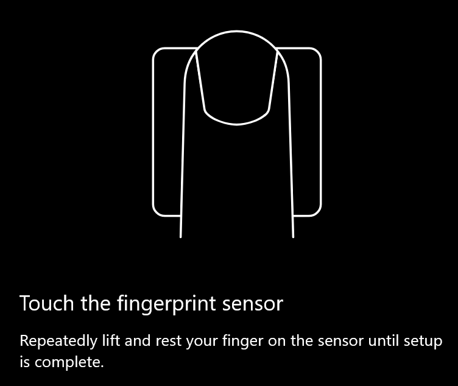
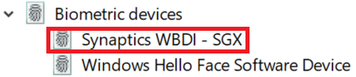

# استخدام خيار إلغاء تامين بصمات الأصابع في Windows 10

**تمكين بصمات Windows Hello**

للغاء تامين نظام التشغيل Windows 10 باستخدام بصمات الأصابع ، يجب اعداد بصمه الاصبع في Windows Hello عبر أضافه (السماح ل Windows بالتعرف علي التعرف عليه) علي الأقل باصبع واحد. 

1. انتقل إلى **إعدادات > حسابات > خيارات تسجيل الدخول** (أو انقر [هنا](ms-settings:signinoptions?activationSource=GetHelp)). سيتم ادراج خيارات تسجيل الدخول المتوفرة. على سبيل المثال:

    

2. انقر فوق **بصمات Windows Hello**أو اضغط عليها ، ثم **انقر فوق اعداد**. في نافذه اعداد Windows Hello ، انقر فوق **بدء**الاستخدام. سيتم تنشيط مجس بصمات الأصابع ، ستتم مطالبتك بوضع اصبعك علي المجس:

   

3. اتبع الإرشادات التي ستسالك عن تكرار التقاط بالاصبع. عند الانتهاء من ذلك ، سيتوفر لديك خيار أضافه أصابع أخرى قد ترغب في استخدامها لتسجيل الدخول. في المرة التالية التي تسجل فيها الدخول إلى Windows 10 ، سيتوفر لديك خيار استخدام بصمه الاصبع الخاصة بك للقيام بذلك.

**لا تتوفر بصمات الأصابع في Windows Hello كخيار لتسجيل الدخول**

إذا لم تظهر بصمات الأصابع في Windows Hello كخيار في **خيارات تسجيل الدخول**، فهذا يعني ان نظام التشغيل windows لا يدرك بأي قارئ أو ماسح ضوئي آخر متصل بالكمبيوتر الشخصي الخاص بك ، أو ان نهج النظام يمنع استخدامه (إذا كان الكمبيوتر تتم ادارته بواسطة مكان عملك). لاستكشاف الأخطاء وإصلاحها: 

1. حدد زر **البدء** في شريط المهام وابحث عن **أداره الاجهزه**.

2. انقر أو اضغط لفتح **أداره الاجهزه**.

3. في "أداره الاجهزه" ، قم بتوسيع أجهزه المقاييس الحيوية بالنقر فوق شارة رتبتها.

   

4. يجب ان يكون ماسح بصمات الأصابع مدرجا كجهاز المقاييس الحيوية ، مثل ماسح سينابتيكس وبدي المحمول:

   

5. إذا لم يظهر الماسح الضوئي لبصمه الاصبع ، وكان الماسح الضوئي مدمجا في الكمبيوتر الشخصي ، فانتقل إلى موقع ويب الشركة المصنعة للكمبيوتر الشخصي. في قسم الدعم التقني لنموذج الكمبيوتر الشخصي ، ابحث عن برنامج تشغيل Windows 10 للماسح الضوئي الذي يمكنك تثبيته.

6. إذا كان الماسح الضوئي منفصلا عن الكمبيوتر الشخصي (المرفق بواسطة USB) ، فانتقل إلى موقع ويب الشركة المصنعة للماسح الضوئي للبحث عن برنامج تشغيل الجهاز الذي يعمل بنظام Windows 10 وتثبيته لنموذج الماسح الضوئي الذي تملكه.
