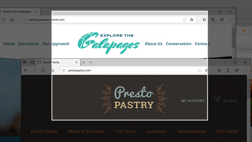
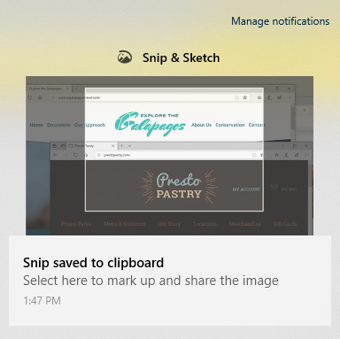

# استخدم القصاصة & رسم لالتقاط الصور ووضع علامة عليها ومشاركتها

ويسمى الآن رسم الشاشة **قص & رسم**. **لاتخاذ بسرعة قصاصة**:

1. اضغط على **مفتاح شعار ويندوز + التحول + S**. سترى الشاشة تظلم والمؤشر الخاص بك عرض كصليب. 

2. اختر نقطة على حافة المنطقة التي تريد نسخها وانقر على المؤشر. 

3. حرك المؤشر لتسليط الضوء على المنطقة التي تريد التقاطها. ستظهر المنطقة التي تلتقطها على الشاشة.

   

يتم حفظ الصورة التي قطعتها على الحافظة الخاصة بك، جاهزة لللصق في بريد إلكتروني أو مستند. 

**إذا كنت ترغب في تحرير أو عرض الصورة:** 

- انقر فوق رمز الإشعارات في أقصى الجانب الأيمن من شريط المهام؛ ثم انقر فوق الصورة التي قمت بالتقاطها للتو. يتم فتح القصاصة في تطبيق "قص & رسم".

   
