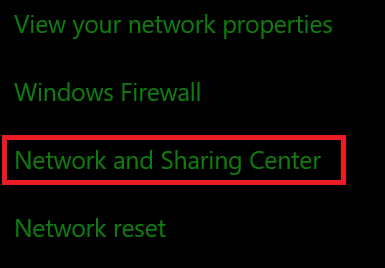
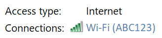
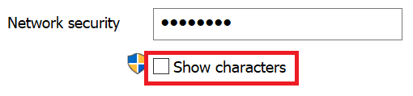

# عرض Wi-Fi مرور الشبكة في Windows 10View Wi-Fi network password in Windows 10

1. تأكد من اتصال الكمبيوتر الشخصي الذي يعمل بنظام التشغيل Windows 10 بشبكة Wi-Fi.Make sure your Windows 10 PC is connected to the Wi-Fi network.

2. انتقل إلى **إعدادات > الشبكة & الإنترنت > الإنترنت**، أو انقر  أو اضغط هنا لتدعنا نأخذك إلى هناك الآن.)Go to **Settings  > Network & Internet  > Status**, or click or tap [here](ms-settings:network?activationSource=GetHelp) to let us take you there now.)

3. انقر **فوق الشبكة ومركز المشاركة**.Click **Network and Sharing Center**.

    

4. في **مركز الشبكة والمشاركة**، إلى بجانب **الاتصالات**، سترى اسم الشبكة اللاسلكية.In **Network and Sharing Center**, next to **Connections**, you will see the name of your wireless network. على سبيل المثال، إذا كانت شبكتك تسمى "ABC123"، فقد ترى:For example, if your network is named "ABC123," you might see:

    

    انقر فوق اسم الشبكة اللاسلكية لفتح نافذة Wi-Fi الاتصال.Click the wireless network name to open the Wi-Fi Status window. 

5. في نافذة Wi-Fi، انقر فوق **خصائص** لاسلكية، وانقر فوق علامة **التبويب أمان،** ثم تحقق **من إظهار الأحرف**.In the Wi-Fi Status window, click **Wireless Properties**, click the **Security** tab, and check **Show characters**.

    

